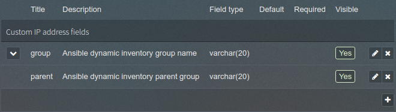
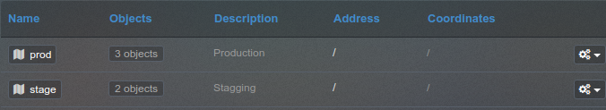
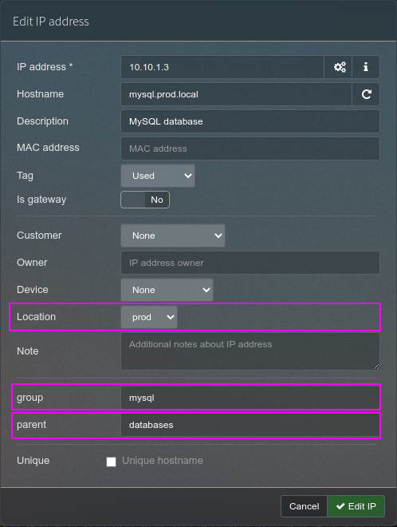

# phpIPAM Inventory

phpIPAM Inventory is an inventory script for Ansible.

## Configuration

**STEP 1)** Create dotenv file as below:

```text
#inventory/.env
IPAM_ADDR=http://ipam.example.come/api/
IPAM_API_USER=inventory
IPAM_USER=admin
IPAM_PASS=password
```

**STEP 2)** Create 2 Custom feilds in phpIPAM for IP Addresses:



**STEP 3)** Create locations in phpIPAM:



*Locations can be Datacenter name or environments for example stage, prod.*

**STEP 4)** In IP address, fill a name for custom field group and if you want this group has a parent group also fill a name in parent custom field:



*IP Addresses without location field will not present in inventory output!*

## Group vars and host vars
All vars should be static in the directory of the dynamic inventory:

### Directory Layout
Any group_vars and host_vars subdirectories in an inventory directory will be interpreted as expected.

```text
inventory
├── group_vars
│   ├── prod
│   ├── stage
│   ├── databases
│   ├── posgresql-prod
│   ├── mysql-prod
│   ├── webserver-prod
│   └── webserver-stage
├── host_vars
└── phpipam_inventory.py
```

### How variables are merged
By default, variables are merged/flattened to the specific host before a play is run. This keeps Ansible focused on the Host and Task, so groups don’t survive outside of inventory and host matching. By default, Ansible overwrites variables including the ones defined for a group and/or host. The order/precedence is (from lowest to highest):

* all group (because it is the ‘parent’ of all other groups)
* parent group
* child group
* host

## Usage

```bash
python inventory/phpipam_inventory.py --list
```
*Use **--list --refresh** for refresh cache file!*

### With ansible-inventory:

```bash
ansible-inventory inventory/phpipam_inventory.py --list
```

## Output
```json
# ansible-inventory --inventory=inventory/phpipam_inventory.py --list
{
    "_meta": {
        "hostvars": {
            "db.stage.local": {
                "_meta": {
                    "hostvars": {}
                },
                "service_ntp": true
            },
            "mysql.prod.local": {
                "_meta": {
                    "hostvars": {}
                },
                "service_ntp": true
            },
            "pg.prod.local": {
                "_meta": {
                    "hostvars": {}
                },
                "service_ntp": true
            }
        }
    },
    "all": {
        "children": [
            "databases",
            "mysql",
            "posgresql",
            "prod",
            "stage",
            "ungrouped"
        ]
    },
    "databases": {
        "children": [
            "databases-prod"
        ]
    },
    "databases-prod": {
        "children": [
            "mysql-prod",
            "posgresql-prod"
        ]
    },
    "mysql": {
        "children": [
            "mysql-prod",
            "mysql-stage"
        ]
    },
    "mysql-prod": {
        "hosts": [
            "mysql.prod.local"
        ]
    },
    "mysql-stage": {
        "hosts": [
            "db.stage.local"
        ]
    },
    "posgresql": {
        "children": [
            "posgresql-prod"
        ]
    },
    "posgresql-prod": {
        "hosts": [
            "pg.prod.local"
        ]
    },
    "prod": {
        "children": [
            "databases-prod",
            "mysql-prod",
            "posgresql-prod"
        ]
    },
    "stage": {
        "children": [
            "mysql-stage"
        ]
    }
}
```


## Contributing
Pull requests are welcome. For major changes, please open an issue first to discuss what you would like to change.

Please make sure to update the tests as appropriate.

## License
[MIT](https://choosealicense.com/licenses/mit/)
